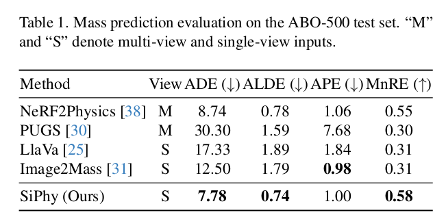
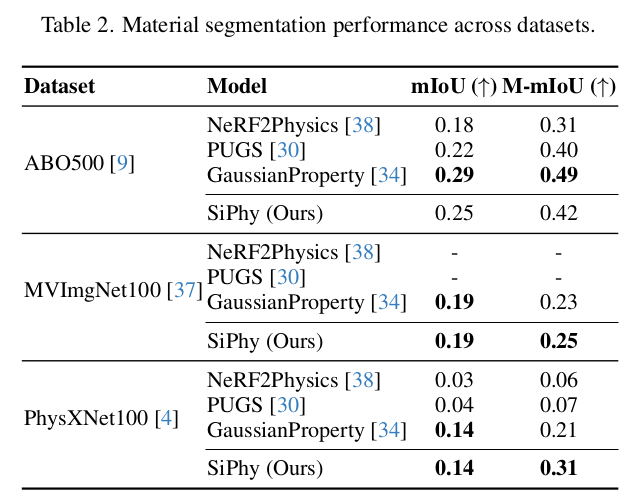

# SiPhy: Single Image Physical Property Reasoning
Hoang Le, Elkhan Ismayilzada, Joonwoo Kwon, Yufei Zhang, Zijun Cui
[](https://drive.google.com/file/d/1fN2MFvkPzkfr7bouEJ59voNFNnB9Zs9_/view?usp=sharing)

.png)
%201%20(1).png)



## Requirements
### Installing Dependencies
Our method operates on the extracted depth maps/point cloud (which we provide in our dataset). The only things you need to do are 1) [install PyTorch](https://pytorch.org/get-started/locally/), 2) run
```
pip install -r requirements.txt
```
to install the remaining  of the main environment. 3) Install the requirements for SAM (preferably a separate environment from the last one)
```
pip install -r requirements_sam.txt
```


### BLIP-2 Model
Our method uses [BLIP-2-Flan-T5-XL](https://huggingface.co/Salesforce/blip2-flan-t5-xl) for image captioning. To download the model weights, clone the repository into the root directory of this repository (you will need Git LFS). You can also download it elsewhere and specify the location via the `--blip2_model_dir` argument.

### OpenAI API Key
Our method involves calling GPT via the [OpenAI API](https://platform.openai.com/). This requires having an account with some credits on it (usage will be fairly minimal). Once you have an account, find your API key [here](https://platform.openai.com/api-keys) and set a variable named `OPENAI_API_KEY` to your key in a Python file named `my_api_key.py`. Example (replace `<yourkey>` with your API key): 
```
echo "OPENAI_API_KEY = '<yourkey>'" >> ./my_api_key.py
``` 

## ABO-500 Dataset
We provide **ABO-500**, a dataset of multi-view images of objects from [Amazon Berkeley Objects (ABO)](https://amazon-berkeley-objects.s3.amazonaws.com/index.html) with camera parameters and ground-truth object weights. We also provide the intermediate outputs from our method so that you can run any part of our method without needing to run the previous parts. Please download the dataset via [this Box link](https://uofi.box.com/shared/static/743ydh4n1xi0dj05lcyyg4evqk2n4dko.zip) 
and unzip into a directory `data/` (you can also put it elsewhere and specify `--data_dir` later).

Example with curl:
```
curl -L  https://uofi.box.com/shared/static/743ydh4n1xi0dj05lcyyg4evqk2n4dko.zip \
    --output ./abo_500.zip
unzip ./abo_500.zip -d ./data/
```

## MLP checkpoint
Download these checkpoints and put in folder checkpoints

| Regularizer   | GT of regularizer | Checkpoints |
| ------------- | -------------     | ------------|
| L2            | Dot Product       |     [LINK](https://huggingface.co/lexuanhoang1904/Attention-based_MLP/resolve/main/mlp_attention_contrastive_L2_150_dot_product.pth)        |
| L2  | SAM + CLIP     |  [LINK](https://huggingface.co/lexuanhoang1904/Attention-based_MLP/resolve/main/mlp_attention_contrastive_combined_L2_150.0_SAMCLIP90.pth)|
|L2            | BLIP2 | [LINK](https://huggingface.co/lexuanhoang1904/Attention-based_MLP/resolve/main/mlp_attention_contrastive_combined_L2_lamb_150.0_blip2_contrastive_50.pth)|
| Cross-Entropy | Dot Product | [LINK](https://huggingface.co/lexuanhoang1904/Attention-based_MLP/resolve/main/mlp_attention_contrastive_CrossEntropy_lamb_1.0_contrastive_dot_product.pth)|
| Cross-Entropy | SAM + CLIP | [LINK](https://huggingface.co/lexuanhoang1904/Attention-based_MLP/resolve/main/mlp_attention_contrastive_CrossEntropy_lamb_1.0_SAMCLIP.pth)|
| Cross-Entropy | BLIP2 |      [LINK](https://huggingface.co/lexuanhoang1904/NeRF2Physic-Generalization/resolve/main/mlp_attention_contrastive_CrossEntropy_lamb_1.0_blip2.pth) | 

## Usage with ABO500
Overview of our method:

We provide separate Python scripts for running each component in our method. Command-line arguments for all of the scripts can be found in `arguments.py`. Intermediate outputs get stored in the scene data directories. If you are using our provided dataset, you can start from anywhere along the pipeline without running the previous components.

### CLIP Feature Fusion
Feature fusion is done in `feature_fusion.py`. Example (only processes one scene):
```
python feature_fusion.py\
    --split test \
    --end_idx 1 \
    --property_name density\
    --source_point_stride 10 \
    --feature_load_name 2d_patch\
    --feature_save_name 2d_patch

```

### Captioning and View Selection (optional, output included in ABO500)
Captioning and view selection are both done in `captioning.py`. Example (only processes one scene):
```
python captioning.py --end_idx 1
``` 
This requires downloading the BLIP-2 model (see Requirements above). 


### LLM Material Proposal (optional, output included in ABO500)
Material proposal is done in `material_proposal.py`. You can specify the physical property of interest using the `--property_name` argument. Currently, only mass density, friction, and Shore hardness are supported, but feel free to make prompts for other properties (see `gpt_inference.py`). Example (only processes one scene):
```
python material_proposal.py --property_name density --end_idx 1
``` 
This requires setting your OpenAI API Key (see Requirements above).

### SAM inference (using SAM environment)
```
cd external/sam2

python tools/abo_inference.py \
    --viz_sam\
    --device cuda:5\
    --advance_box_mask\
    --postprocess_masks\
    --log_file log_file/log_sam10.txt \
    --data_dir ../../data/abo_500
```


### CLIP-based Kernel Regression (Final Prediction)
Physical properties are predicted using CLIP-based kernel regression in `predict_property.py`. Example (only processes one scene) (with MLP):
```
python predict_property.py\
    --split test \
    --end_idx 1 \
    --source_point_stride 10 \
    --property_name density\
    --feature_load_name 2d_patch\
    --feature_save_name 2d_patch\
    --model mlp_attention \
    --testing\
    --mlp_checkpoint checkpoints/mlp_attention_contrastive_stride10_one_mask_combined_L2_100 0_s0_e-1_train_bs8_contrastive_20250615_034932_17.pth\
    --advance_box_mask \
    --postprocess_masks \
    --overwrite\
    --evaluate\
    --result_path log/results34.csv
``` 

By default, the script will predict a volume integral of the physical property (e.g. predicting mass by integrating density). You can instead get dense results for a 3D grid of points by setting `--prediction_mode` to `grid`. You can also write your own code using the `predict_physical_property_query` function to query points however you want.

### Evaluation (optional, also included in predict_property.py script)
We provide a script for quantitative evaluation of mass predictions in `evaluation.py`. The results will be printed in your terminal. Example:
```
python evaluation.py
``` 
Explanations of each metric can be found in our paper.

### Visualization
We provide a script for interactively viewing and saving 3D visualizations in `visualization.py`. You should specify the scene name using the `--scene_name` argument. [Example](viz/B07B4G5RBN_ATVPDKIKX0DER/_stride10_dense5_0_1_2d_patch_correction60_test_mlp_attention_lossContrastive+L2_l2_lambda100.0_one_mask_epoch17.pth_Our+SAM_MLP+attention_contrastive+l2+100_epoch17/_combined.png):

--combine_dict example/rules:
key must be an integer > 2 (in this case 7)
model: mlp_checkpoint
name: custom as you like
mlp_checkpoint: checkpoint path

{
    "7": {
        "name": "Our+SAM_MLP+attention_contrastive+l2+100_epoch17",
        "model": "mlp_attention",
        "mlp_checkpoint": "checkpoints/mlp_attention_contrastive_stride10_one_mask_combined_L2_100.0_s0_e-1_train_bs8_contrastive_20250615_034932_17.pth"
    }
}

The third image from the left is material segmentation

```
python pipeline_generation_script.py\
    --split test\
    --end_idx 1\
    --show 1\
    --no_orig\
    --source_point_strides 10\
    --viz_only\
    --all_combi\
    --combine_dict viz/viz_combine_dicts/viz_combine_dict_attention_test.json\
    --plot_type combined\
    --no_orig\
    --plot_source_points\
    --advance_box_mask\
    --postprocess_masks\
    --one_mask \
    --overwrite\
    --viz_save_name contrastive_l2_loss_our22_test \
    --log_file log_file/log32.txt \
    --output_sh scripts/viz_0_combine_sam_mlp_attention_test.sh\
    --dense_point_strides 1\ 

    scripts/viz_0_combine_sam_mlp_attention_test.sh
```

## Acknowledgements

This repo contains code that's based on the following repos

NeRF2Physics[https://github.com/ajzhai/NeRF2Physics]
